#Homework 1 Report
***Linxi Fan ( lf2422 )***

All the codes run without error in Matlab R2014b. 

The source files are included as part of the submission, and all of them are heavily commented.

The \LaTeX\ source code of this report and all the matlab png images are also included.

## Problem 1

Problem 1 related codes are in `problem1.m`. By running `problem1` in Matlab console, the plots shown below can be reproduced. 

### Part 1
Empirically, the range of reasonable $a_m$ values is approximately $[0.3, 15.0]$. 

The code plots the Hodgkin-Huxley voltage with $a_m = 3.0$.

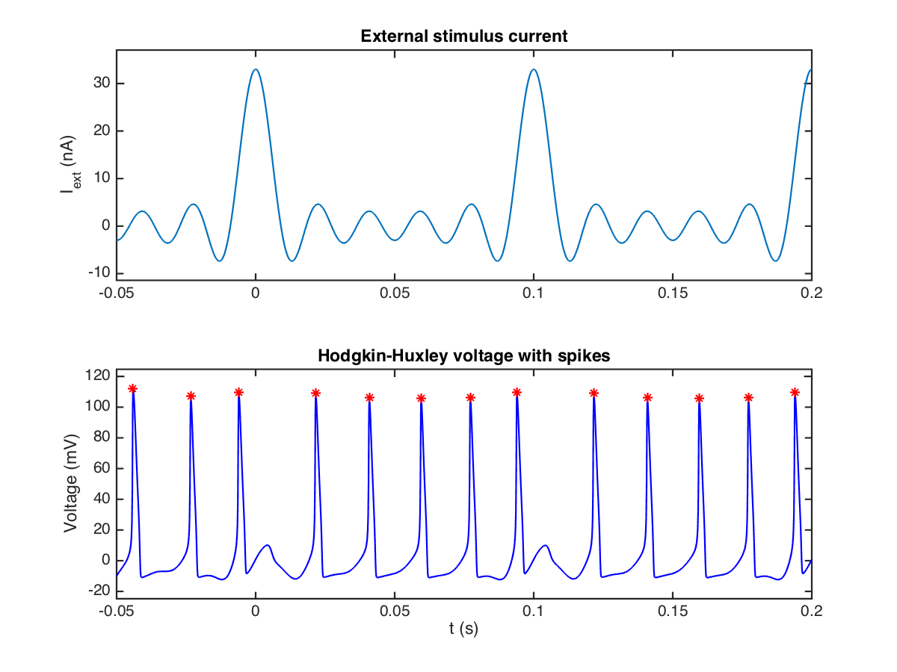

### Part 2
The $a_m$ values I tried are $0.1 \le a_m \le 4.0$ with a $0.1$ increment.
The first plot shows the total number of spikes VS $a_m$.
The second plot shows the average number of spikes per second VS $a_m$.

As we can see from the graph, the number of spikes increases as $a_m$ increases.

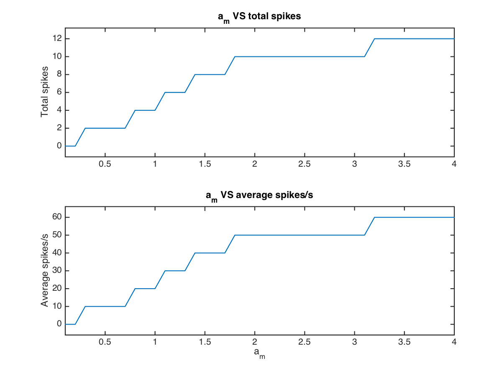

### Part 3
Bandlimited white noise is calculated by `wgn.m` function. The function arguments are:

$wgn(t, \sigma^2)$ where $\sigma^2$ is the power level.

The first plot repeats the experiment in part 1: it shows the external stimulus current with noise added, and its effect on the voltage. 

\newpage
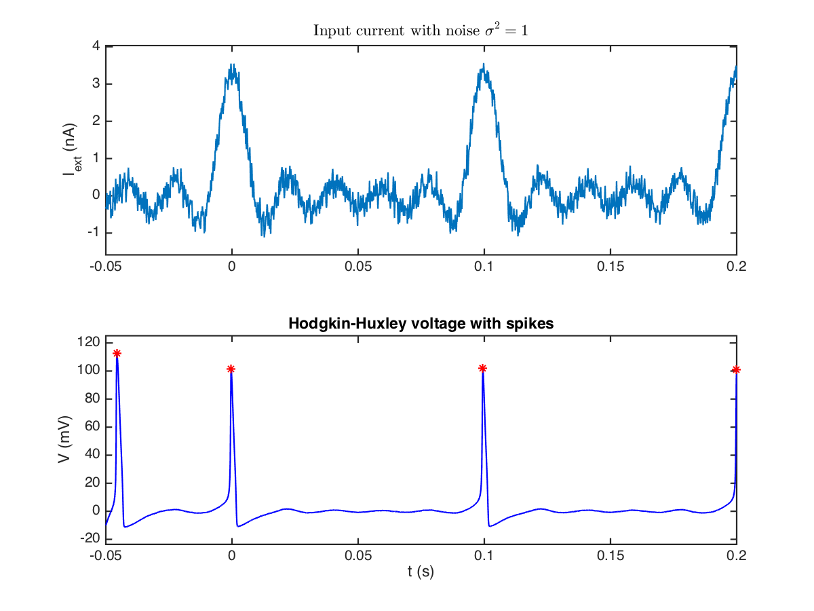

The second plot repeats the experiments in part 2 and represents a 3D function of amplitude $a_m$, noise power $\sigma^2$ and firing frequency (spikes/s). 
(Because it takes very long to compute, the actual code included in my submission plots only a subset of the experiments I tried. )

I use $a_m$ as the measure for characterizing external current because it represents the amplitude of the current, which is one of the key signatures of the signal. 

$X$-axis is $a_m$: $\begin{cases} 0.1 \le a_m \le 4.0 \\ \Delta a_m = 0.1 \end{cases}$

$Y$-axis is $\sigma^2$: $\begin{cases} 0.0 \le \sigma^2 \le 20.0 \\ \Delta \sigma^2 = 1.5 \end{cases}$

$Z$-axis is the corresponding firing frequency (spikes/s) for each pair $(a_m, \sigma^2)$.

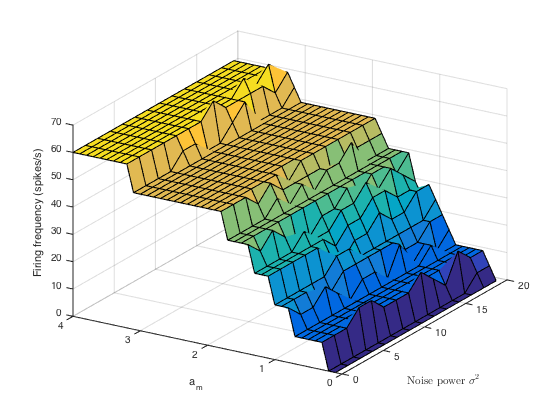

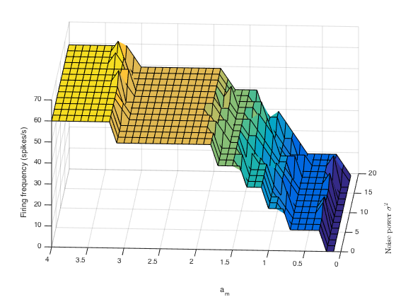

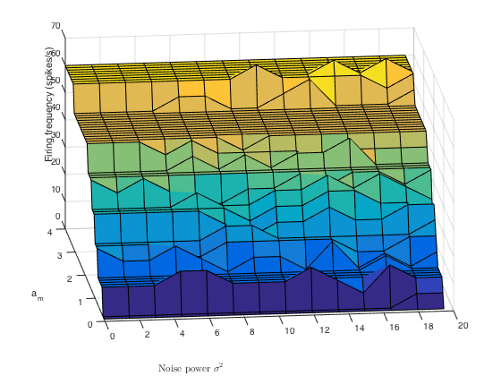

\newpage

## Problem 2

Problem 2 related codes are in `problem2.m`. By running `problem2` in Matlab console, the plots shown below can be reproduced. 

### Part 0

Plot $I_{ext}$, $V$, $I_K$, $I_{Na}$, and $C\frac{dV}{dt}$ as functions of time $t$. 

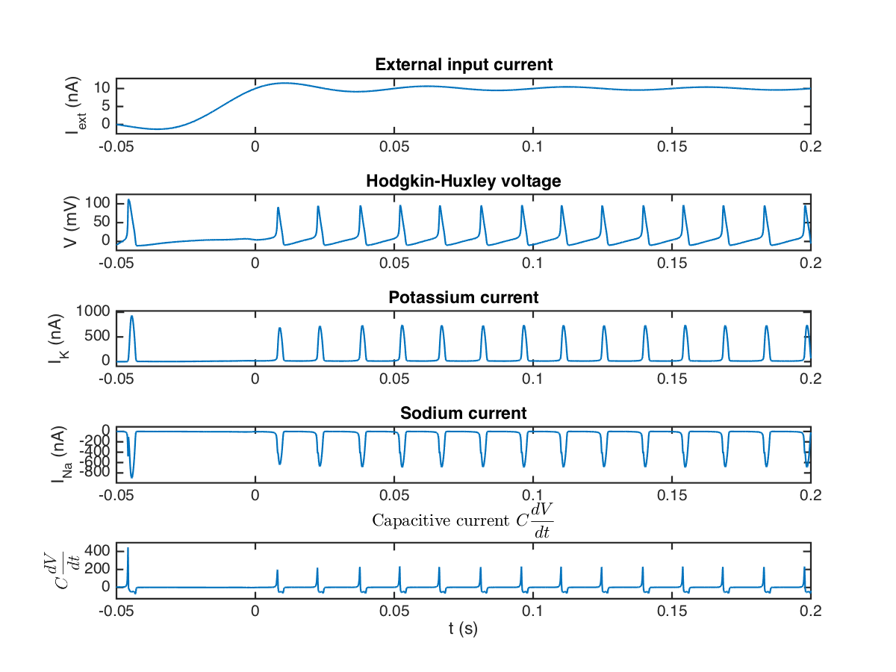

\newpage

### Part 1

Plot $I_K$, $V_K$, internal state $x_K$, and memconductance $g_K$ as functions of time $t$. 

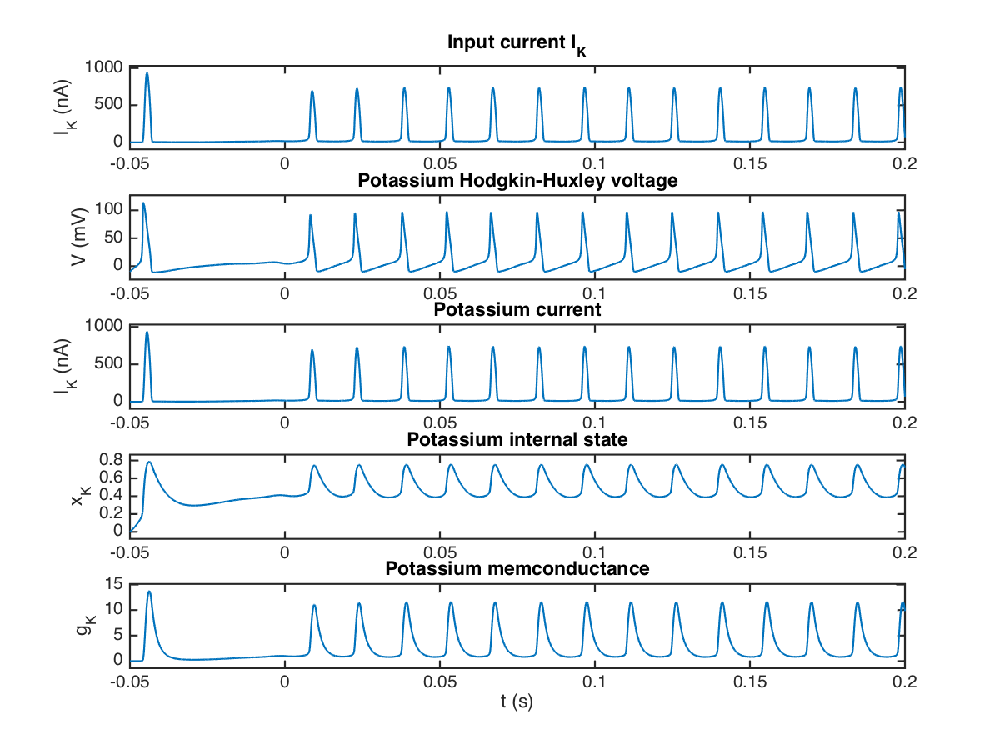

\newpage

### Part 2

Plot memconductance $g_K$ vs $V_K$, and $g_K$ vs flux $\Phi_K = \int_{}{} V_K$.

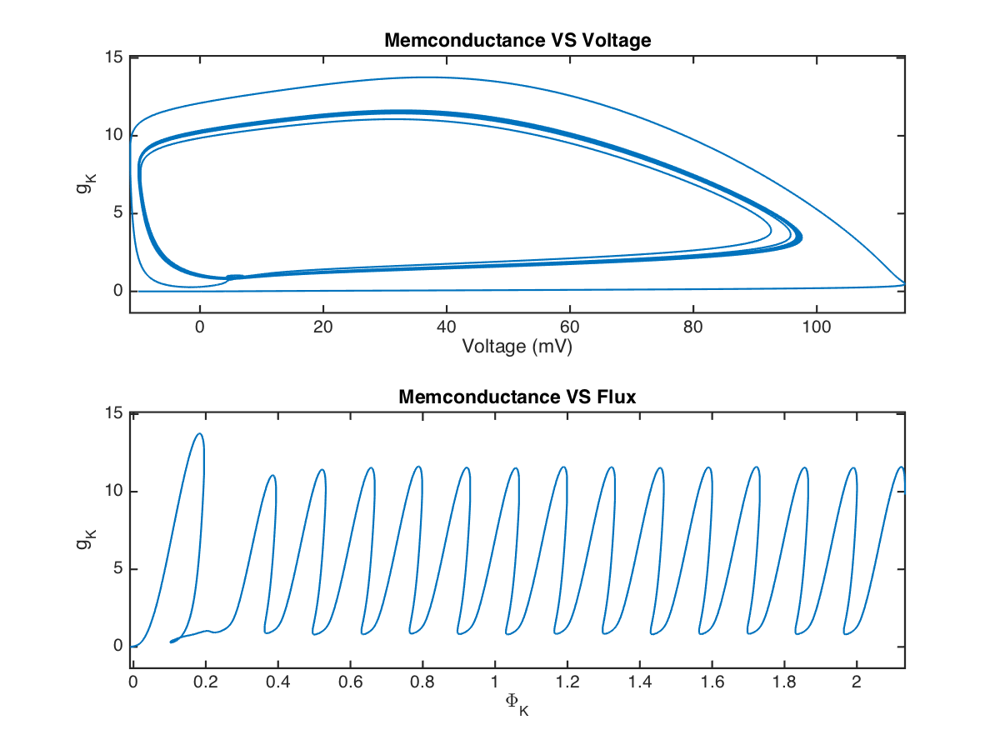

\newpage

### Part 3

Plot $I_K$ vs $V_K$, and $Q_K = \int_{}{} I_K$ vs flux $\Phi_K = \int_{}{} V_K$.

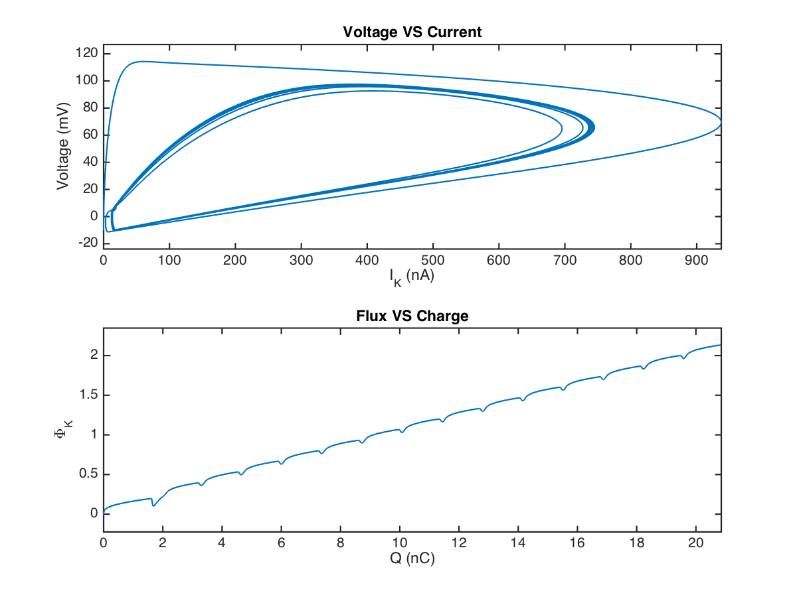

\newpage

## Bonus

Bonus related codes are in `bonus.m`. By running `bonus` in Matlab console, the plots shown below can be reproduced. 

I have spent almost an entire day trying to debug the numerical instability problem. It doesn't seem to be fully solved.

### Part 0

Plot $I_{ext}$, $V$, and $I_{Na}$ as functions of time $t$. 

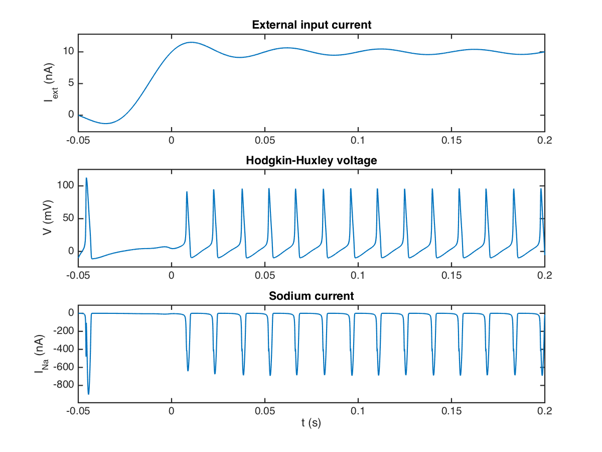

\newpage

### Part 1

Plot $I_{Na}$, $V_{Na}$, internal state $x_{Na}$, and memconductance $g_{Na}$ as functions of time $t$. 

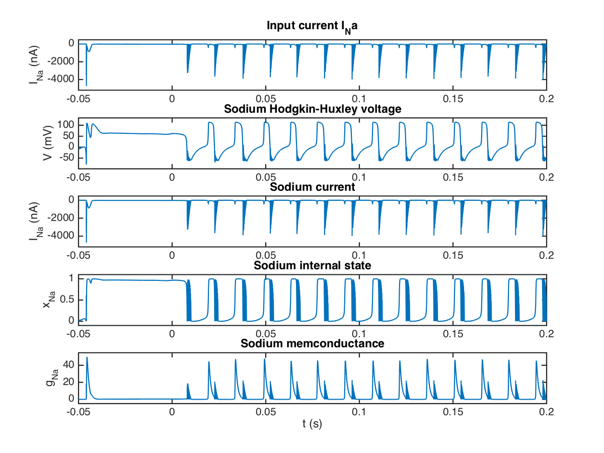

\newpage

### Part 2

Plot memconductance $g_{Na}$ vs $V_{Na}$, and $g_{Na}$ vs flux $\Phi_{Na} = \int_{}{} V_{Na}$.

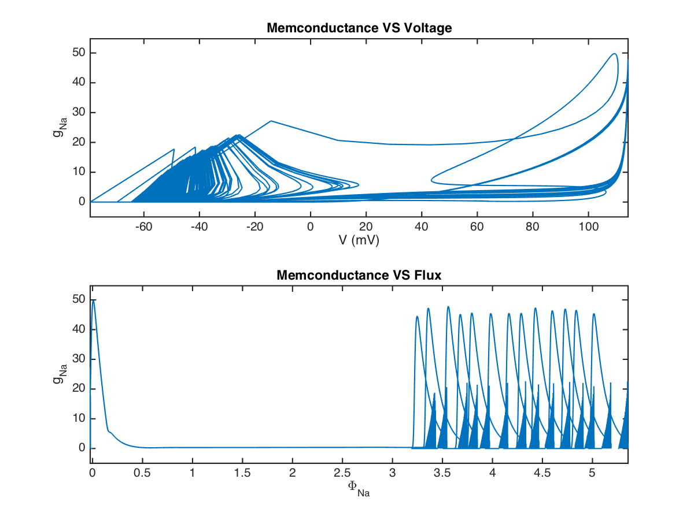

\newpage

### Part 3

Plot $I_{Na}$ vs $V_{Na}$, and $Q_{Na} = \int_{}{} I_{Na}$ vs flux $\Phi_{Na} = \int_{}{} V_{Na}$.

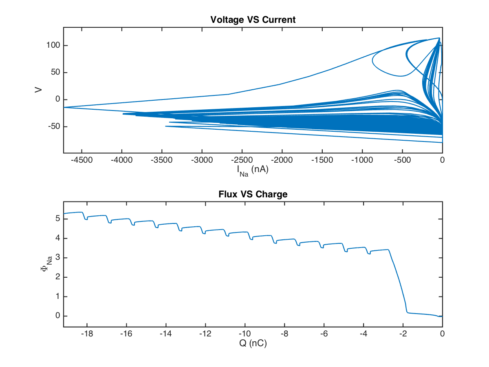
